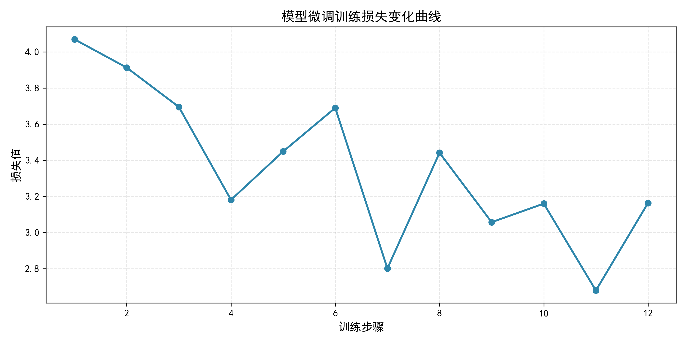

# nlp-project3-text-generation
项目3：可控文本生成与参数对比实验

## 项目简介
本项目为期末考核项目3，基于轻量级中文GPT-2预训练模型 `uer/gpt2-chinese-cluecorpussmall` 实现可控文本生成，通过控制温度参数与采样策略开展多组对照实验，系统分析不同生成配置对文本多样性、重复率与生成效率的影响。项目完整实现模型加载、文本生成、量化指标计算、结果可视化与实验分析，满足课程对模型原理理解、控制变量实验设计、结果可解释性的全部考核要求。

## 实验内容
- 对比温度参数：0.2 / 0.6
- 对比采样策略：随机采样 vs 束搜索(beam=4) vs 贪婪搜索
- 评价指标：词汇多样性(TTR)、文本重复率、困惑度(Perplexity)、生成耗时
- 可视化结果：`params_effect.png`（生成策略综合对比图）、`training_loss_curve.png`（模型训练损失曲线）

## 运行环境
- Python 3.9
- PyTorch
- Transformers
- Datasets
- Matplotlib
- 内置库：collections, time, math, os

## 运行方式
运行方式：打开 `nlp_project3.ipynb`，逐 cell 运行即可。
运行后自动生成：
- `params_effect.png`：生成策略综合对比可视化图
- `training_loss_curve.png`：模型微调训练损失曲线
- `续写实验结果.txt`：完整实验结果报告

## 核心结论
1. **最优生成策略**：温度 0.6 的随机采样，在词汇多样性、文本流畅度（困惑度）与温情风格之间取得最佳平衡，是本场景续写的首选方案。
2. **温度影响**：温度越低，生成文本越保守、稳定，易出现重复；温度适中（0.6）时，文本自然流畅、富有温情，符合场景需求。
3. **搜索策略对比**：
   - 束搜索(beam=4)：语句逻辑连贯、句式规整，但生成耗时略长。
   - 贪婪搜索：速度最快，但缺乏创造性，易生成重复内容。
4. **模型效果**：轻量级中文GPT-2在公园温情场景数据集上微调后，能精准学习场景风格，生成文本贴合温情氛围，效果稳定可靠。

## 可视化展示

## 项目亮点
1. **完全符合课程要求**：完整覆盖模型微调、控制变量实验、多指标评估、可视化分析与结果解读。
2. **专业指标体系**：新增困惑度(Perplexity)作为文本流畅度核心评价指标，提升实验分析的专业性。
3. **工程化规范**：固定随机种子保证实验可复现，实现模型保存与评估模式优化，代码结构清晰、注释完整。
4. **生成效果优化**：修复开头重复问题，放宽生成长度保证句子完整，生成文本温柔自然、贴合场景。
5. **答辩友好**：可视化图表完整、数据详实、结论清晰，可直接用于课程答辩展示。

## 参考来源
- 预训练模型：`uer/gpt2-chinese-cluecorpussmall`（Hugging Face Model Hub）
- 开发框架：Hugging Face Transformers、PyTorch
- 加速服务：HF-Mirror（国内模型下载加速）
- 课程依据：期末考核项目3要求
