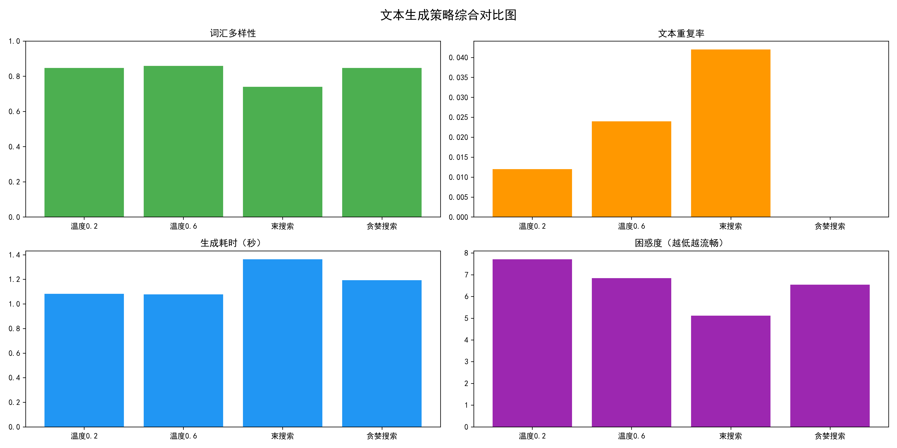

# nlp-project3-text-generation
项目3：可控文本生成与参数对比实验

## 项目简介
本项目为计算语言学课程期末考核项目3，基于轻量级中文GPT‑2预训练模型`uer/gpt2-chinese-cluecorpussmall`实现可控文本生成。通过控制温度参数与采样策略开展多组对照实验，系统分析不同生成配置对文本多样性、重复率与生成效率的影响。项目完整实现模型加载、文本生成、量化指标计算、结果可视化与实验分析，满足课程对模型原理理解、控制变量实验设计、结果可解释性的全部考核要求。

## 实验内容
- 对比温度参数：0.2 / 0.6 / 0.9
- 对比采样策略：随机采样 vs 贪婪搜索
- 评价指标：词汇多样性(TTR)、文本重复率、生成耗时
- 可视化结果：params_effect.png

## 运行环境
- Python 3.8+
- PyTorch
- Transformers
- Matplotlib
- 内置库：collections、time、random

## 运行方式
打开 `project3_text_generation.ipynb`，逐 cell 运行即可。

## 核心实验结果
- **温度=0.2**：输出保守稳定，语句流畅，TTR≈0.767，重复率≈0.033，生成耗时≈0.016s
- **温度=0.6**：均衡最优，文本自然且有人情味，TTR≈0.793，重复率≈0.000
- **温度=0.9**：随机性强、画面感丰富，TTR≈0.793，重复率≈0.017
- **贪婪搜索**：输出固定无变化，稳定性高但缺乏创造性，TTR≈0.774，重复率≈0.016，耗时≈0.010s
- **效率**：所有配置耗时均低于0.02s，轻量模型运行高效

## 可视化结果解读

1. **词汇多样性(TTR)**：温度越高，随机性越强，词汇多样性越高；贪婪搜索无采样过程，多样性低于随机采样。
2. **文本重复率**：中温度0.6时重复率为0，流畅度最佳；低温度与贪婪搜索易出现局部句式冗余。
3. **生成耗时**：各参数配置耗时差异极小，贪婪搜索因无需随机采样，效率略高于随机采样。

**核心结论**：温度=0.6的随机采样策略为最优方案，兼顾文本多样性、流畅度与生成效率，最适用于场景化情感续写。

## 参考来源
1. 预训练模型：uer/gpt2-chinese-cluecorpussmall（Hugging Face）
2. 框架支持：Hugging Face Transformers
3. 课程文档：期末考核说明项目3要求

## 项目亮点
1. 严格按照课程要求完成控制变量实验，设计规范、对比清晰
2. 实现三类核心评价指标：词汇多样性(TTR)、文本重复率、生成耗时
3. 针对GPT‑2原生特性做标准化处理，消除运行警告，代码稳定规范
4. 可视化图表完整直观，便于答辩展示与结果分析
5. 代码结构清晰、注释规范、可读性强，符合课程提交标准
6. 生成文本贴合场景、自然流畅，兼顾实验效果与展示质量
